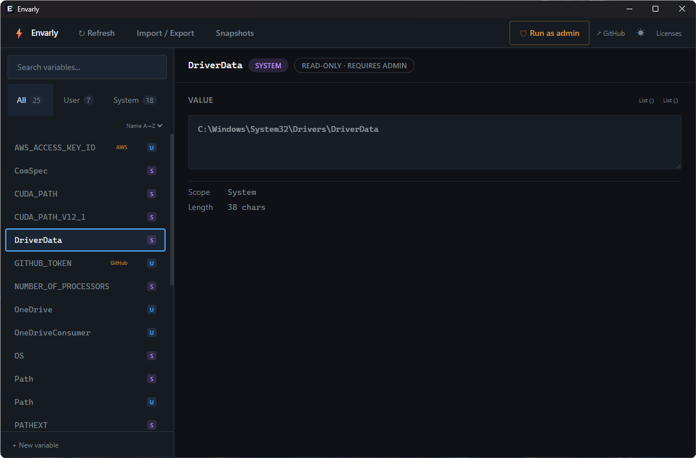

# Envarly

[](https://github.com/iray-tno/envarly/actions/workflows/test.yml)
[](https://github.com/iray-tno/envarly/actions/workflows/security.yml)
[](LICENSE)
[](https://github.com/iray-tno/envarly/releases)
[](https://tauri.app)

Windows environment variable manager built with Tauri v2, React, TypeScript, and Rust.

## Screenshot



## Features

- **2-pane UI** — sidebar variable list with search/filter and scope tabs (All / User / System), detail editor on the right
- **List editor** — drag-and-drop reordering for PATH, PATHEXT, NO\_PROXY, and any semicolon- or comma-separated variable; auto-detects separator from name and value; supports manual override between list and plain-text modes
- **Path validation** — per-entry existence check (green ✓ / red ✗) for PATH-style entries; PATHEXT skips filesystem checks since its entries are extensions, not paths
- **`%VAR%` reference lint** — warns on unresolvable `%VAR%` references in path entries; evaluated on focus-out; suppresses false positives for Windows built-in volatile vars (`USERPROFILE`, `APPDATA`, `TEMP`, …)
- **Local undo (Ctrl+Z)** — multi-step undo of unsaved edits in the detail panel, before staging; drag reorder and text edits are separate undo steps; works even when a text field has focus
- **Dark / light mode** — follows system preference on first launch; persists across sessions; no flash on load
- **Snapshot / time-travel** — save named snapshots, restore to any previous state
- **Diff detection** — detects registry changes made by other processes while Envarly is open; shows a diff with selective apply (accept or revert per entry)
- **Import / Export** — read/write `.json` and `.reg` formats; export to IaC formats (PowerShell script, DSC v2/v3, Ansible playbook)
  - *Custom export*: pick individual variables, with secret-variable warnings
  - *Import merge strategy*: Merge (additive) or Replace (sync — removes variables not in the file)
  - Preview before any write; registry is never touched until you explicitly click Apply
- **PATH management** — stage adding Envarly's install directory to User or System PATH directly from within the app; PATH banner on launch if not yet added; button in the PATH variable detail panel
- **Apply confirmation diff** — Delta view (git-diff-style `+`/`−` per entry) and Full view (all entries with change markers) for semicolon-separated values like PATH; non-list values shown in full without truncation
- **Critical variable warning** — staging changes to `SYSTEMROOT`, `WINDIR`, or `COMSPEC` shows a prominent warning in the Apply confirmation dialog
- **Secret detection** — name-based + value-pattern detection across 35+ token formats (GitHub `ghp_`, GitLab `glpat-`, Slack `xoxb-`, Anthropic `sk-ant-`, npm `npm_`, PyPI `pypi-`, …); service badge shown on each match; **⚠ Secrets** sidebar tab; export confirmation lists affected services
- **Admin elevation** — "Run as admin" button restarts the process elevated via UAC; system variables become editable; "Restart as admin →" inline hint appears in the detail panel when viewing a System variable without elevation
- **CLI mode** — read-only subcommands (`get`, `list`, `export`) run from a terminal without launching the GUI
- **WM\_SETTINGCHANGE broadcast** — running apps pick up changes without a restart

## Stack

| Layer | Tech |
|---|---|
| Desktop shell | Tauri v2 |
| Frontend | React 19 + TypeScript |
| Styling | Tailwind CSS v4 |
| Rust backend | winreg, clap, serde\_json, chrono, thiserror |
| Linter / formatter | Biome |
| JS tests | Vitest + @testing-library/react |
| Rust tests | cargo test (MemBackend — no real registry writes) |
| Component explorer | [Storybook 10](https://iray-tno.github.io/envarly/storybook/) + addon-a11y |
| Runtime versions | mise (Node 22, Rust stable) |

## Prerequisites

- [mise](https://mise.jdx.dev/) — installs the correct Node and Rust versions automatically
- Windows 10 / 11 (registry access required)

## Getting started

```sh
mise install          # install Node 22 and Rust stable
npm install           # install JS dependencies
cd src-tauri && cargo fetch && cd ..  # prefetch Rust crates
```

## Development

```sh
npm run tauri dev     # start Tauri + Vite dev server (hot-reload)
```

## Testing

```sh
npm test                       # Vitest in watch mode
npm run coverage               # coverage report (V8)
npx vitest run                 # single run (used in CI)
cd src-tauri && cargo test     # Rust unit tests (runs on Linux/macOS too)
```

## Storybook

```sh
npm run storybook     # http://localhost:6006 — includes axe-core a11y audit per story
```

## Lint & format

```sh
npm run lint          # Biome check
npm run lint:fix      # auto-fix
npm run format        # format only
npm run check-version # verify package.json / tauri.conf.json / Cargo.toml versions match
```

## Build

```sh
npm run tauri build   # produces installer in src-tauri/target/release/bundle/
```

## Releasing a new version

Release artifact policy and installer checks are documented in [docs/distribution.md](docs/distribution.md).

```sh
npm version patch     # or minor / major
# → bumps package.json, syncs tauri.conf.json and Cargo.toml, commits + tags
git push --follow-tags
# → triggers the Release workflow on GitHub Actions (builds installer, uploads to GitHub Releases)
```

## CLI usage

> CLI subcommands work in debug builds or when launched from an existing terminal in release.
> In release GUI builds, stdout is not attached to the console (Windows subsystem).

```sh
# Print a variable's value
envarly get PATH
envarly get JAVA_HOME --scope user

# List all variables
envarly list
envarly list --scope system --format json

# Export to file or stdout (read-only — does not modify the registry)
envarly export --format json     --output backup.json
envarly export --format reg      --output backup.reg
envarly export --format ps1      --output backup.ps1      # PowerShell [Environment]::SetEnvironmentVariable
envarly export --format dsc_v2   --output backup.ps1      # PowerShell DSC v2 configuration
envarly export --format dsc_v3   --output backup.dsc.yaml # DSC v3 YAML
envarly export --format ansible  --output backup.yml      # Ansible environment playbook
envarly export --format json | jq '.user.PATH'
```

## Demo mode

Demo mode opens the GUI with fixture data and keeps every change in memory, so it is safe for screenshots, walkthroughs, and release media.

```sh
envarly --demo
envarly --demo --demo-fixture path\to\fixture.json
envarly --demo-fixture=path\to\fixture.json
```

The bundled fixture lives at `src/demo/envarly-demo.json`. Custom fixtures use the same shape and can include User/System variables, snapshots, PATH validation results, and an initial baseline for external-change demos.

## Import / Export (GUI)

Open the **Import / Export** tab.

### Export

| Scope | What's included |
|---|---|
| All | Every User + System variable |
| User | User variables only |
| System | System variables only |
| Custom | Hand-pick individual variables from a checklist |

Supported formats:

| Format | Description |
|---|---|
| `.json` | Envarly-native |
| `.reg` | Windows Registry Script |
| `.ps1` (PowerShell) | `[Environment]::SetEnvironmentVariable` calls |
| `.ps1` (DSC v2) | PowerShell Desired State Configuration v2 |
| `.dsc.yaml` (DSC v3) | DSC v3 YAML |
| `.yml` (Ansible) | Ansible playbook with `ansible.builtin.set_fact` |

In **Custom** mode, variables whose names or values match known secret patterns are flagged with a `⚠ ServiceName` badge.

When clicking **Export**, Envarly checks whether the selection contains secrets. If it does, a confirmation step lists the affected services (e.g. "AWS, GitHub credentials will be included"). Export only proceeds after explicit confirmation.

### Import

1. Upload a file or paste its content, then click **Parse** to preview.
2. Check the variables you want to apply.
3. Choose a merge strategy:
   - **Merge** — adds / updates variables from the file; leaves everything else untouched.
   - **Replace** — makes the target scope exactly match the file (deletes variables not present in the file). A danger banner appears as a reminder.
4. Click **Apply Selected** — this is the only point where the registry is written.

## Secret detection

`src/lib/secrets.ts` provides two complementary detection strategies:

**Name-based** — `detectSecret(name): SecretInfo | null`

1. Exact match against ~25 well-known variable names (`AWS_SECRET_ACCESS_KEY`, `GITHUB_TOKEN`, `DATABASE_URL`, …)
2. Service-prefix + secret keyword (`STRIPE_SECRET_KEY` → Stripe, `AZURE_CLIENT_SECRET` → Azure, …)
3. Generic keyword fallback (`MY_WEBHOOK_URL` → Generic)

**Value-based** — `detectSecretByValue(value): SecretInfo | null`

Recognises ~35 structured token formats by their prefix regardless of variable name:

| Prefix | Service |
|---|---|
| `ghp_` `gho_` `ghs_` `github_pat_` | GitHub |
| `glpat-` `gloas-` `glcbt-` | GitLab |
| `xoxb-` `xoxp-` `xapp-` | Slack |
| `sk-ant-` | Anthropic |
| `sk-proj-` | OpenAI |
| `sk_live_` `sk_test_` | Stripe |
| `AKIA` / `ASIA` (20-char) | AWS |
| `npm_` | npm |
| `pypi-` | PyPI |
| `hf_` | HuggingFace |
| `dapi` | Databricks |
| `hvs.` `hvb.` | HashiCorp Vault |
| `SG.` | SendGrid |
| `shpat_` `shpss_` | Shopify |
| `pscale_tkn_` | PlanetScale |

**Combined** — `resolveSecret(name, value): SecretInfo | null` — name first, value fallback. Use this when both are available (variable list, import preview, export).

Detected secrets are shown with a `⚠ ServiceName` badge (e.g. `⚠ AWS`, `⚠ GitHub`). Values are masked with `••••••••` in import/export views. The **⚠ Secrets** tab in the sidebar filters the variable list to secrets only.

## Snapshots

Snapshots are stored as JSON files under `%LOCALAPPDATA%\Envarly\snapshots\`. Each file contains the full user and system environment at the time of the snapshot. They can be listed, restored, or deleted from within the app.

## CI

| Workflow | Trigger | Jobs |
|---|---|---|
| `test.yml` | Every push | Frontend (vitest) + Rust (cargo test) + version consistency check |
| `release.yml` | Tag push `v*` or manual | Windows build → GitHub Releases |
| `security.yml` | Weekly (Mon 09:00 UTC) or manual | npm audit + cargo audit |

## Project structure

```
envarly/
├── src/                          # React frontend
│   ├── api.ts                    # Tauri invoke wrappers
│   ├── types.ts                  # Shared TypeScript types
│   ├── context/
│   │   └── ThemeContext.tsx      # Dark/light theme context
│   ├── hooks/
│   │   ├── useEnvVars.ts         # Variable list data hook
│   │   ├── useStaged.ts          # Staging area: Map<"Scope:name", StagedChange>; effectiveVars merge
│   │   ├── useUndoStack.ts       # Generic undo/redo stack (stage-level operations)
│   │   ├── useStagingHandlers.ts # Orchestrates stageSet/stageDelete/stageImport/stageSnapshot
│   │   └── useTheme.ts           # Theme persistence + toggle
│   ├── lib/
│   │   ├── cn.ts                 # clsx + tailwind-merge helper
│   │   ├── diff.ts               # Pure diff computation (no side effects)
│   │   ├── lint.ts               # %VAR% reference lint for path values; Windows built-in allowlist
│   │   └── secrets.ts            # Secret detection: name-based + value pattern (35+ token formats)
│   └── components/
│       ├── ui/                   # Atomic UI primitives
│       │   ├── Badge.tsx
│       │   ├── Button.tsx
│       │   ├── IconButton.tsx
│       │   ├── Modal.tsx
│       │   ├── SegmentedControl.tsx
│       │   ├── TextInput.tsx
│       │   └── Textarea.tsx
│       ├── AppHeader/            # Top bar: refresh, staged-changes count, apply/discard, menu
│       ├── Sidebar/              # Variable list with search, scope filter, ⚠ Secrets tab
│       ├── DetailPanel/          # Variable editor with local undo (Ctrl+Z pre-stage)
│       ├── PathEditor/           # Drag-and-drop list editor + path validation + %VAR% lint
│       ├── ListEditor/           # Generic sortable list editor (comma/semicolon separator)
│       ├── PathBanner/           # Banner shown when Envarly is not yet in PATH
│       ├── StagedModal/          # Apply confirmation: per-entry Delta/Full diff for list values
│       ├── NewVarModal/          # New variable creation dialog
│       ├── SnapshotPanel/        # Snapshot list, create, restore
│       ├── DiffPanel/            # External-change diff with selective apply
│       ├── ImportExportPanel/    # File import / export UI
│       └── LicensesPanel/        # OSS licenses: Envarly (MIT) + third-party (npm + Rust)
├── public/
│   └── theme-init.js             # Runs before React; sets theme class to avoid flash
├── src-tauri/
│   ├── icons/source/             # Logo SVG sources (aurora + monochrome)
│   ├── wix/                      # WiX installer template + branded images; PATH cleanup CA
│   └── src/                      # Rust backend
│       ├── main.rs               # Entry point; CLI dispatch then GUI launch
│       ├── lib.rs                # Tauri builder + command registration
│       ├── cli.rs                # clap CLI (get / list / export)
│       ├── commands.rs           # Tauri commands
│       ├── env_store.rs          # Registry read/write + EnvBackend trait + MemBackend
│       ├── export.rs             # JSON, .reg, and IaC format serialisation / parsing
│       ├── path_manage.rs        # PATH status check + propose-add logic (install dir detection)
│       ├── snapshot.rs           # Snapshot persistence (%LOCALAPPDATA%\Envarly)
│       └── error.rs              # EnvarlyError (thiserror + Serialize)
├── scripts/
│   ├── sync-version.mjs          # Propagates package.json version to tauri.conf.json + Cargo.toml
│   ├── check-version.mjs         # Verifies all three version fields match
│   └── gen-licenses.mjs          # Generates src/assets/oss-licenses.json
├── .github/workflows/
│   ├── test.yml                  # Per-push test + version check
│   ├── release.yml               # Tag-triggered Windows build
│   └── security.yml              # Weekly vulnerability audit
├── .mise.toml                    # Tool versions (Node 22, Rust stable)
├── biome.json                    # Lint / format config
└── vitest.config.ts              # Test config
```

## Architecture notes

### Diff detection

1. `computeDiff()` in `src/lib/diff.ts` — pure function comparing two `EnvSnapshot` objects; returns structured `DiffEntry[]` (added / removed / changed, with scope).
2. `react-diff-viewer-continued` — visual text diff for long values like PATH (split on `;`).

The baseline snapshot is captured on app mount. Every Refresh call re-reads the registry and compares; if the snapshots differ, a **Changes** tab appears automatically.

### Import safety

`parse_import` (Rust) only deserialises the file and returns a snapshot struct — it never calls `write_var`. Registry writes happen only when the user clicks **Apply** in the frontend.

### Test isolation

`env_store.rs` exposes an `EnvBackend` trait. The production `WinregBackend` is compiled only on Windows (`#[cfg(windows)]`). Tests use `MemBackend` — an in-memory `Mutex<HashMap>` that never touches the registry. `cargo test` runs on Linux in CI without any Windows-specific dependencies.

## License

MIT — see [LICENSE](LICENSE).
